# 🚀 Employee Management System (EMS)

An intuitive **Employee Management System (EMS)** built using **modern frontend technologies** for efficient workforce management.

## 🛠️ Tech Stack
- 🎨 **[HeroUI](https://www.heroui.dev/)** – Beautiful UI components
- 🎭 **[Framer Motion](https://www.framer.com/motion/)** – Smooth animations
- 🌐 **[React Router](https://reactrouter.com/)** – Seamless navigation
- 🔄 **[Context API](https://react.dev/reference/react/useContext)** – State management

## ✨ Features  

| Feature                            | Description                                      |
|------------------------------------|--------------------------------------------------|
| ✅ Employee Management             | Add, update, and manage employees efficiently   |
| 🏢 Department Classification       | Organize employees by departments               |
| 🎨 Interactive UI                  | Smooth transitions and animations with Framer Motion |
| 📱 Responsive Design               | Works across one device only (desktop) |
| ⚡ Backend-Free                     | Fully frontend-based, no backend required       |


## 🎯 Why EMS?
This EMS is perfect for small to mid-sized organizations looking for a simple yet effective **frontend-only** employee management solution.

## 📸 Screenshots
### Initial UI
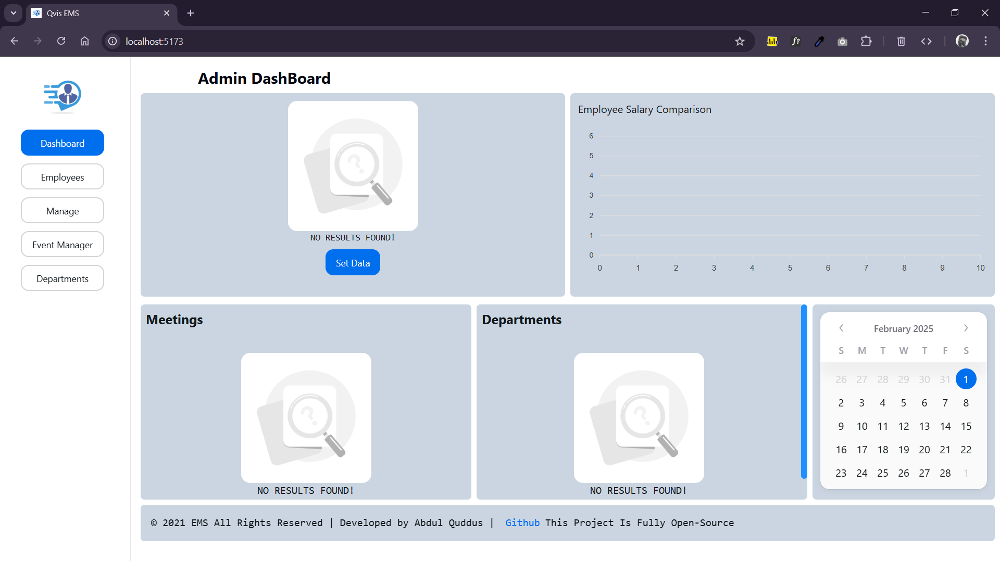
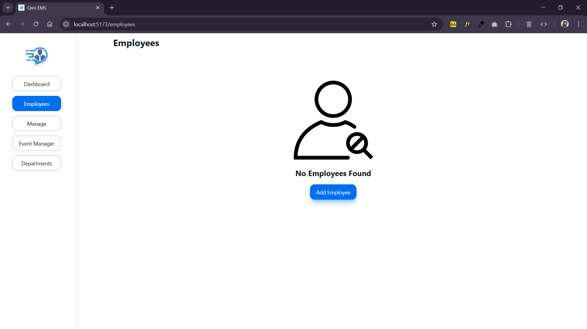
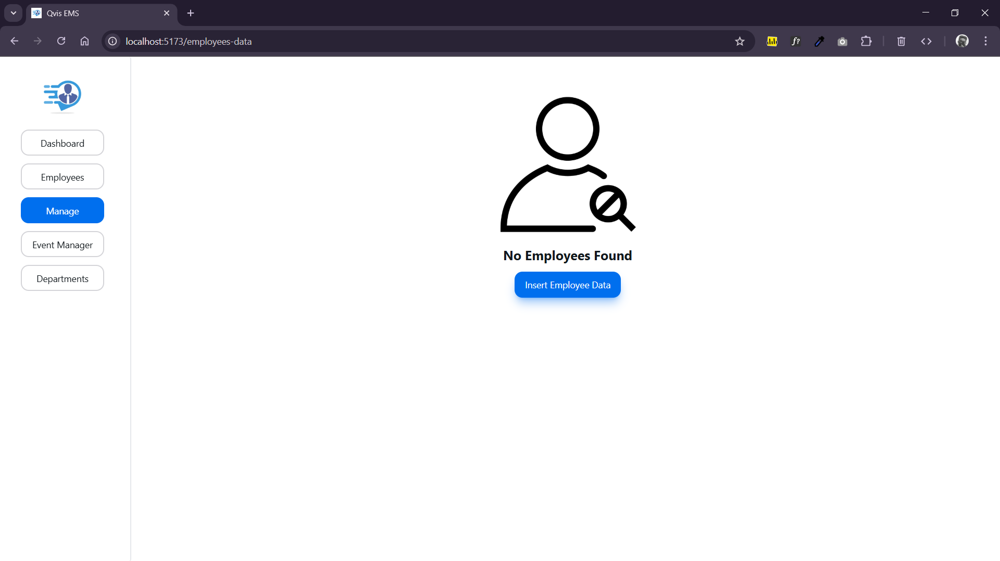
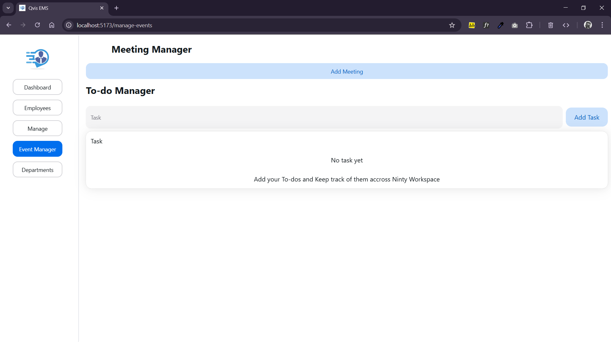
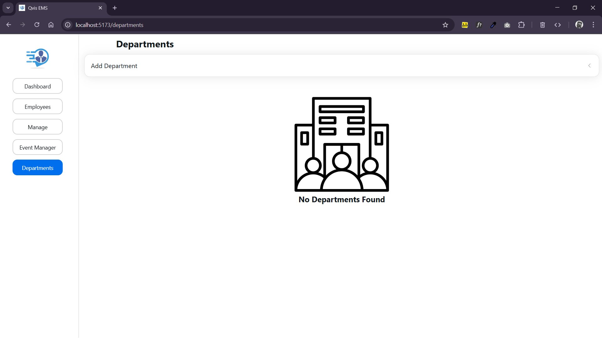

### Input Fields UI
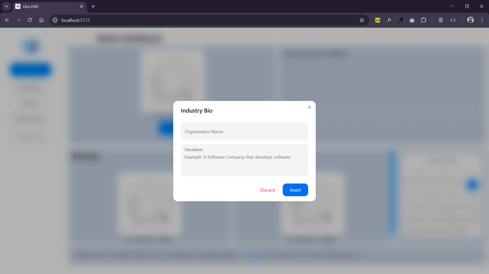
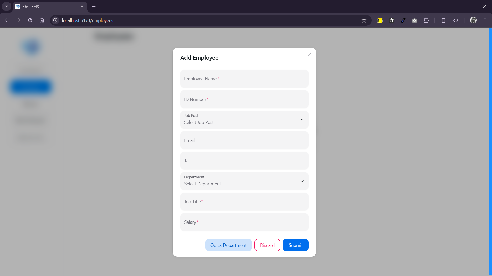
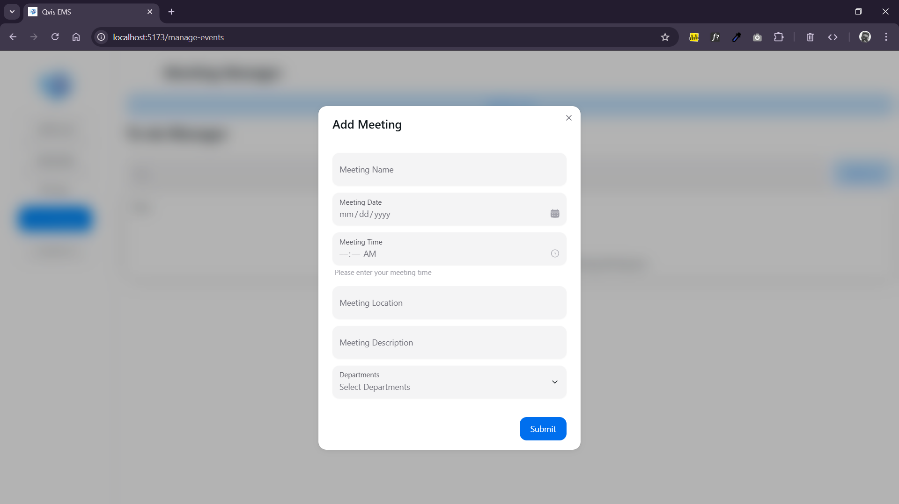
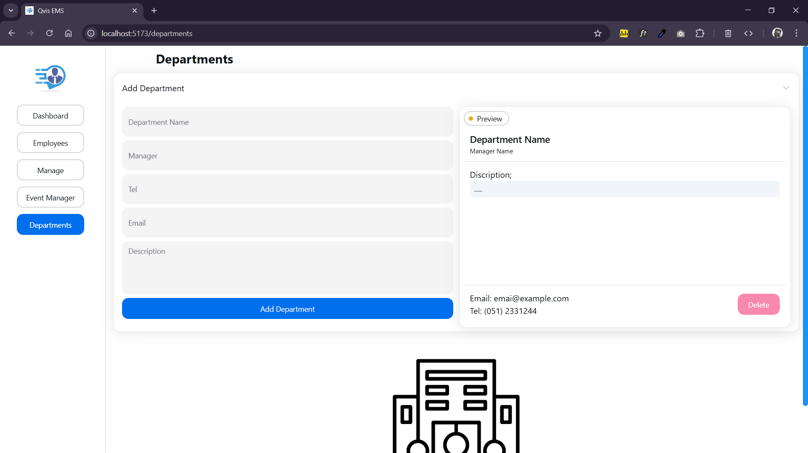

### Data Intered UI 
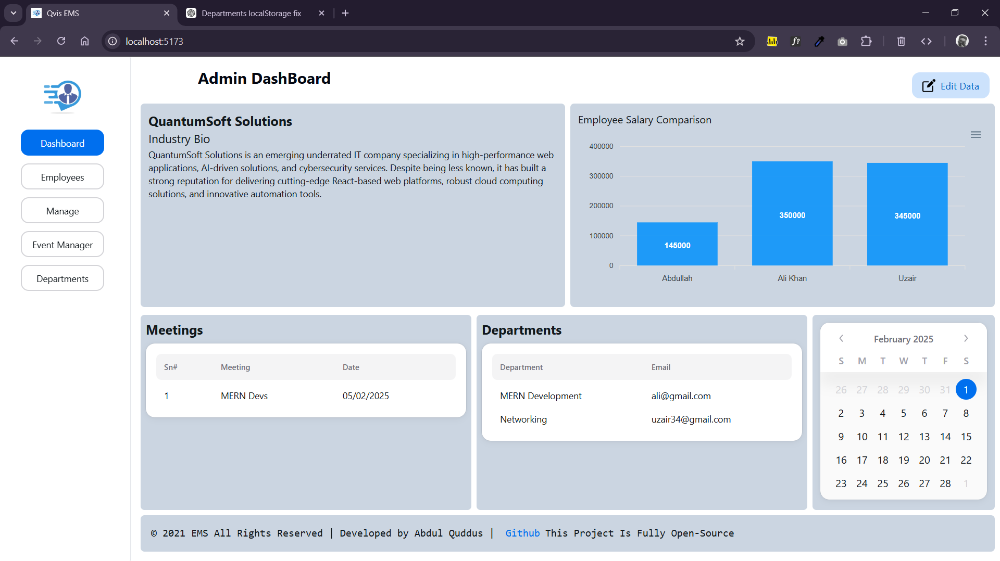
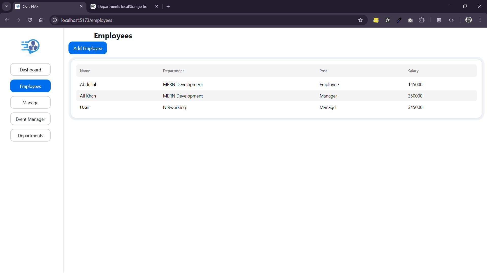
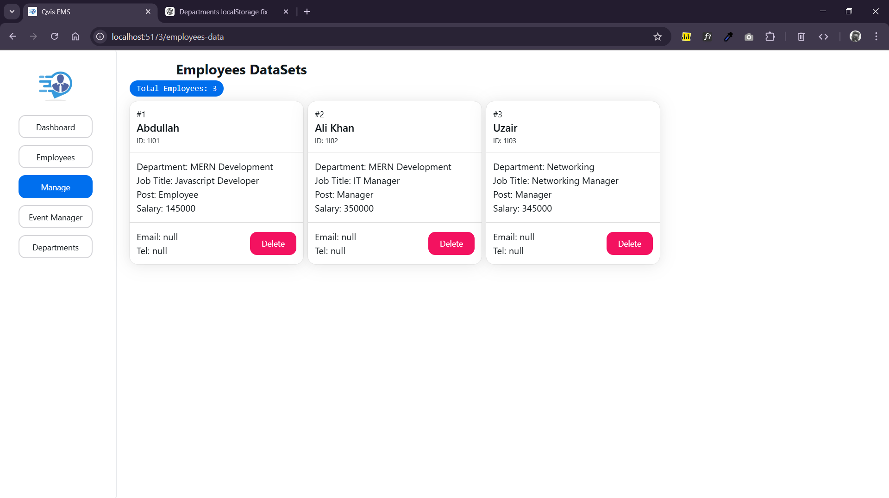
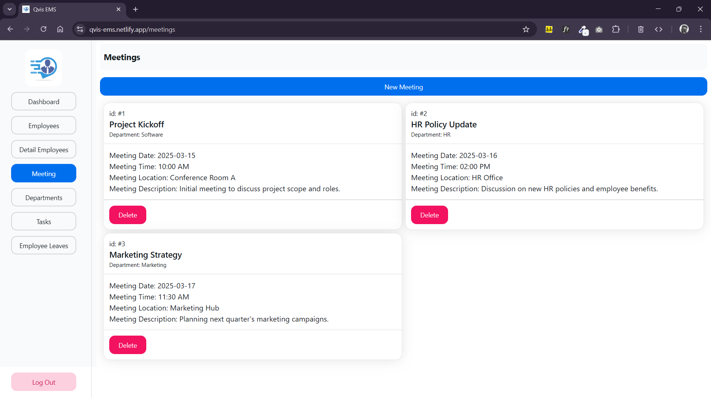

### Mobile UI
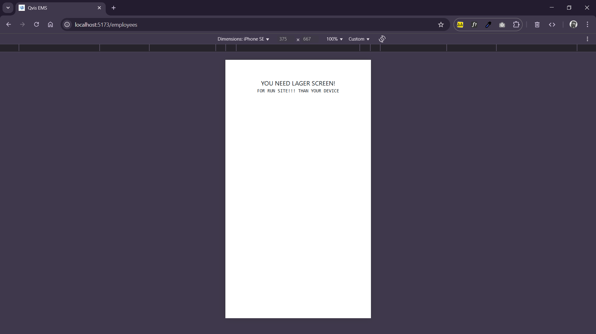


## 🚀 How to Run
1️⃣ Clone the repo:  
   ```bash
git clone https://github.com/EnderTonol/employee-management-system
cd employee-management-system
```
✨Run Project
```bash
npm start
```

#### How Bug Fixes
- Using ChatGPT 🤣 for SessionStorage
- Netlify Pages Navigation Bug Fixes

